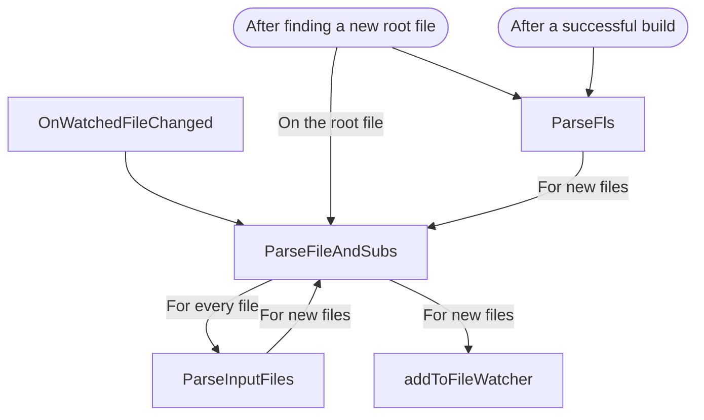

# Development documentation

## The manager logic

The manager is responsible for detecting the correct root file and once detected to parse the whole project. Its logic is shown as follows.


## Scripts for Intellisense

These scripts are actually only frontend to the `pyintel` package, which implements the core mechanisms. It fetches the latest list of packages and classes along with their descriptions from CTAN at https://ctan.org/pkg. It uses the TeXLive Package database `texlive.tlpdb` retrieved from https://mirrors.ircam.fr/pub/CTAN/systems/texlive/tlnet/tlpkg/texlive.tlpdb.

### ctanpkglist.py

It produces the intellisense data for classes and packages and save the result as json files: `../data/classnames.json` and `../data/packagenames.json`.

#### Classes

The list of classes is computed from the TeXLive Package database by looking for all `.cls` files. The description associated to each class is obtained from CTAN.

#### Packages

Getting a proper list of packages is tricky as the package names (as listed by CTAN) do not always match the base names of the `.sty` files to be loaded by `\usepackage`. This is handled in the following way

- We use the TeXLive Package database to
  - List all the `.sty` files provided by TeXLive
  - For every package, list the `.sty` files it contains. The name to pass to `\usepackage` is the base name of one of the `.sty` files listed there.
- For every package `pkg` listed by CTAN
  - If `pkg.sty` exists in the TeXLive Package database, store `pkg` for package intellisense.
  - If not, search if a package `pkg/` exists in the TeXLive Package database and look up a file whose lowercase name matches `pkg`. If it is found, then save it for package intellisense.

As some packages cannot be properly detected using the above mechanism, we maintain a list of extra packages to be added to the list in [extra-packagenames.json](extra-packagenames.json). These packages are automatically added at the end of the [`ctanpkglist.py`](dev/ctanpkglist.py) script.

### unimathsymbols.py

It parses uni-math symbols from http://milde.users.sourceforge.net/LUCR/Math/data/unimathsymbols.txt and save the result as a json file. The result is used to generate command intellisense.

### pkgcommand.py

```
usage: pkgcommand.py [-h] [-o OUTDIR] [-i INFILE [INFILE ...]]

optional arguments:
  -h, --help            show this help message and exit
  -o OUTDIR, --outdir OUTDIR
                        Directory where to write the JSON files. Default is LaTeX-Workshop/data/packages
  -i INFILE [INFILE ...], --infile INFILE [INFILE ...]
                        Files to process. Default is the content of https://github.com/jlelong/LaTeX-cwl/archive/refs/heads/master.zip
```

This script generates intellisense data from the files given by `-i` option and writes the generated `.json` files to the directory specified by `-o`. Note that the directory must already exist.

For every package or class, one `.json` file is generated, containing the data for the package defined in the `.cwl` file. This file has the following structure
```typescript
{
  includes: string[] // this list of string describes the parent packages this package imports
  cmds: {[key: string]: Cmd} // all commands of this package
  envs: {[key: string]: Env} // all environments of this package
  options: string[] // the options that can be used for \usepackage this package
}
```

In this `json` object, the commands have the following structure:
```typescript
{
  command: string, // the command name
  snippet: string, // the snippet to insert
  option: string, // the package option that enables this command
  keyvals: {key: string, snippet: string}[], // the possible optional keyvals of this command
  detail: string | undefined,
  documentation: string | undefined
}
```
An example is:
```json
"acro{}{}": {
  "command": "acro",
  "snippet": "acro{${1:acronym}}{${2:full name}}",
  "option": "",
  "keyvals": []
}
```

The environments have the following structure:
```typescript
{
    name: string, // the environment name
    detail: string, // the signature of this environment, including its name and arguments
    snippet: string, // the snippet to insert after \begin{env}
    option: string, // the package option that enables this environment
    keyvals: {key: string, snippet: string}[] // the possible optional keyvals of this environment
}
```
An example is:
```json
"aligned[]": {
  "name": "aligned",
  "detail": "aligned[alignment]",
  "snippet": "[${1:alignment}]",
  "option": "",
  "keyvals": []
}
```

Completion files for classes are all prefixed by `class-`.

### func3.py

This script generates intellisense data for LaTeX stored in [`../data/expl3.json`](../data/expl3.json).

## Grammar files

All the grammar files `*.tmLangugage.json` in `../syntax/` except `latexblock.tmLanguage.json` are retrieved from https://github.com/jlelong/vscode-latex-basics. They are updated by running the script `update-grammar.js`.
