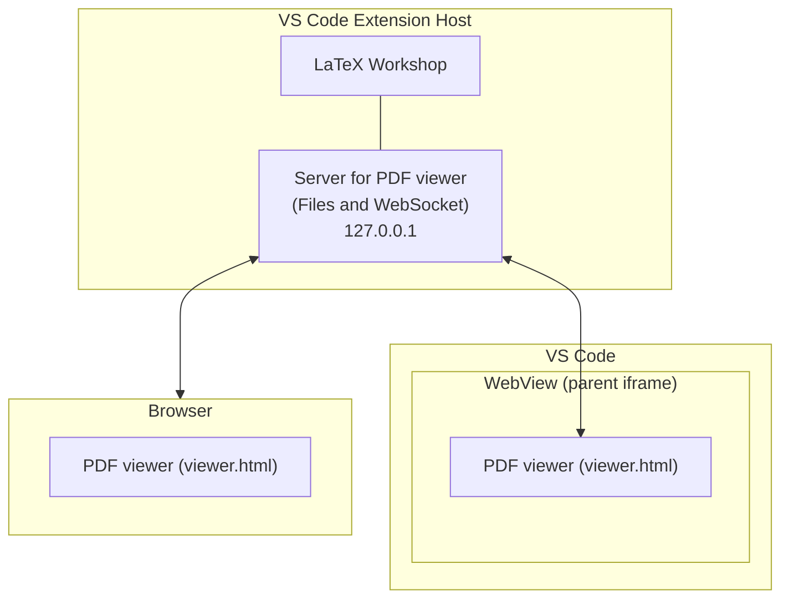
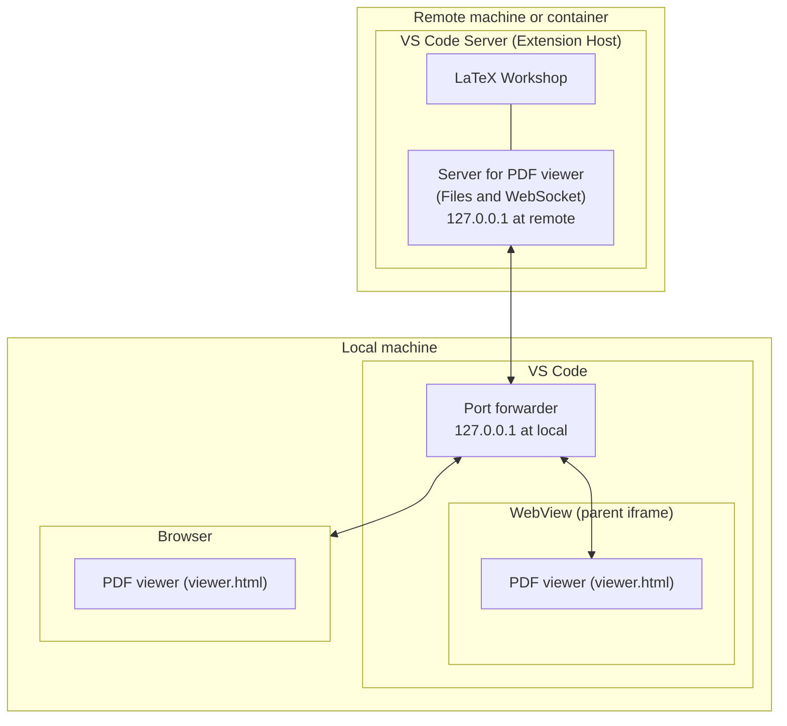
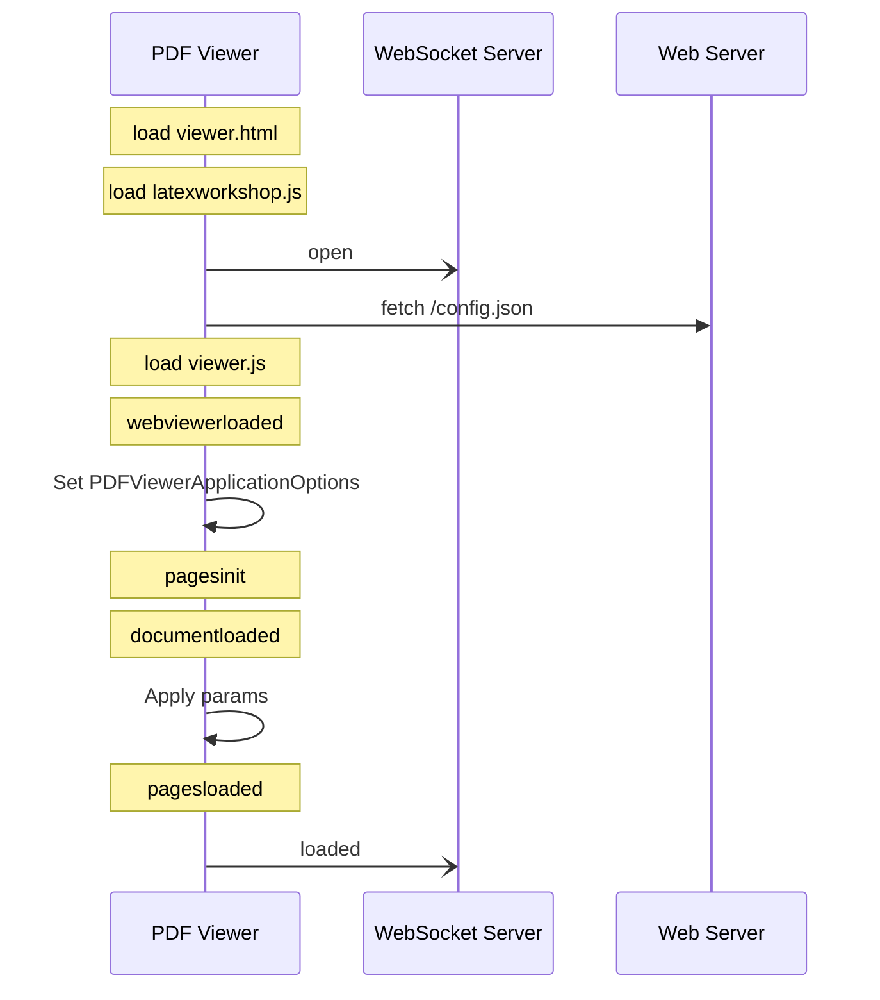
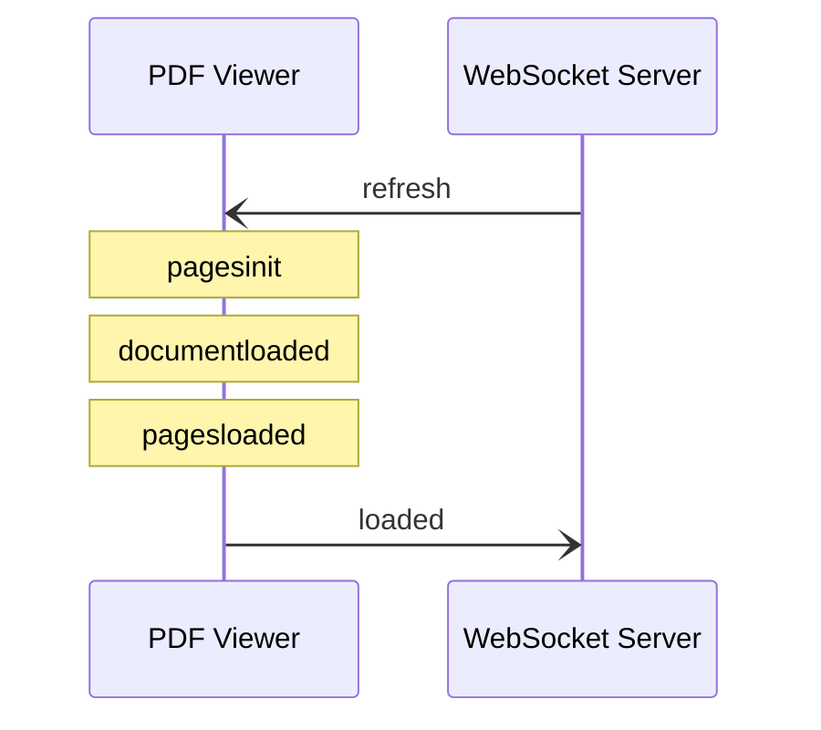
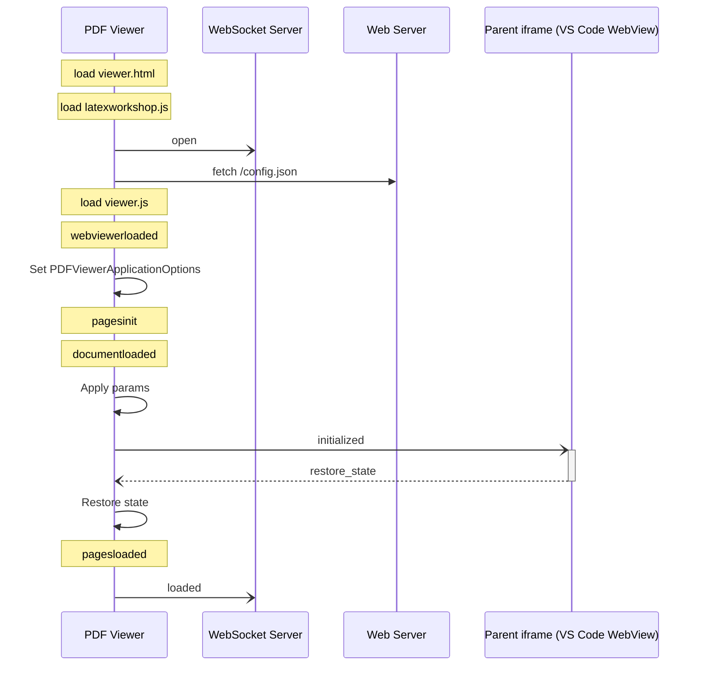
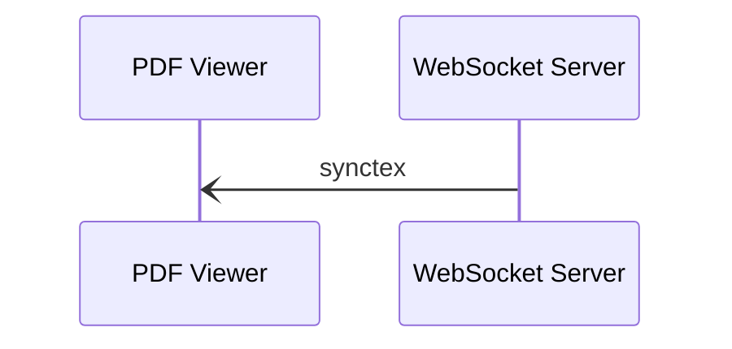
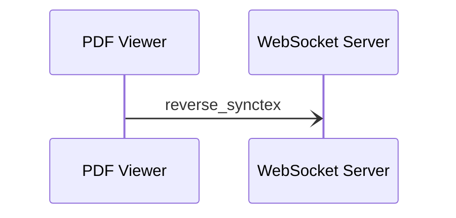
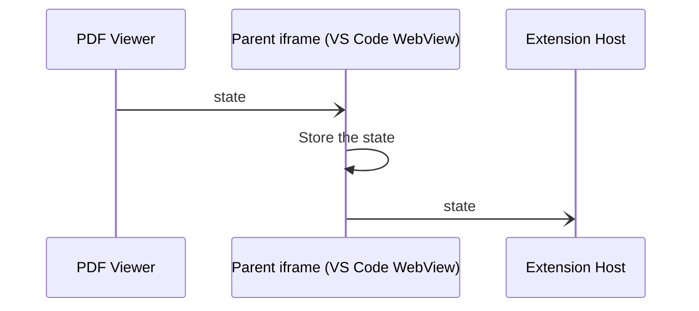
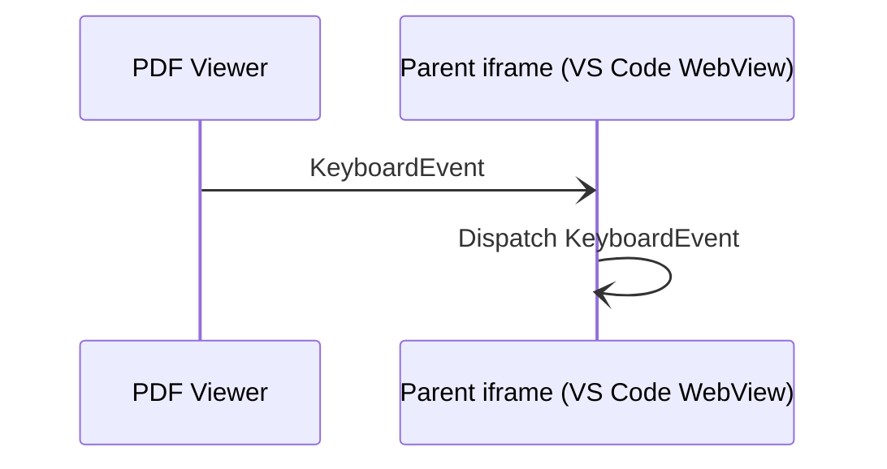
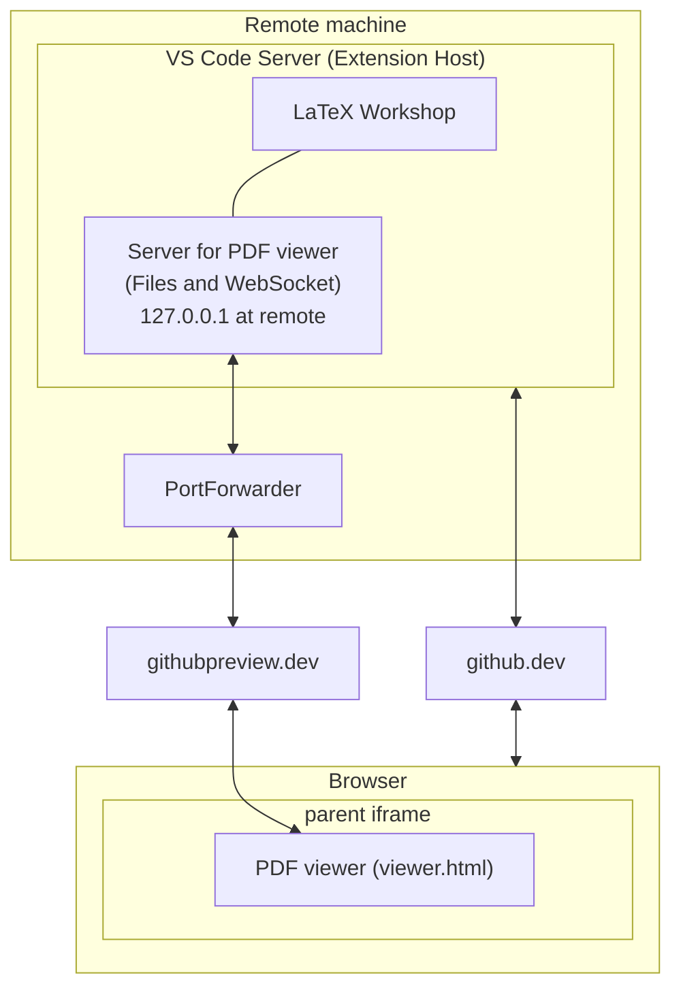

# Overview

The pdf viewer is based on [PDF.js](https://mozilla.github.io/pdf.js/) by Mozilla Foundation. Files are from the [prebuilt download version](https://mozilla.github.io/pdf.js/getting_started/#download). See a [related issue](https://github.com/mozilla/pdf.js/issues/9318#issuecomment-354192067).

We load `viewer.html` of PDF.js in `iframe` in [Webview](https://code.visualstudio.com/api/extension-guides/webview) of VS Code through a local Web [server](https://github.com/James-Yu/LaTeX-Workshop/blob/master/src/components/server.ts). The Webview's content including the `iframe` tag is generated by [Viewer.getPDFViewerContent](https://github.com/James-Yu/LaTeX-Workshop/blob/2fae02734190fb5664f002d0205c06024ff4a8cd/src/components/viewerlib/pdfviewerpanel.ts#L116). On the browser, we directly load `viewer.html`. This architecture enables us to load the same `viewer.html` both on VS Code and on the browser.

We control the PDF viewers on both the tab and the browser through WebSockets in the same way. The handler on the server side is defined as [Viewer.handler](https://github.com/James-Yu/LaTeX-Workshop/blob/2fae02734190fb5664f002d0205c06024ff4a8cd/src/components/viewer.ts#L231).

We provide additional features by setting up new event listeners in `latexworkshop.ts` for DOM objects in `viewer.html`. We do not and should not override functions defined by PDF.js.

We can see all the changes, [diff](https://github.com/James-Yu/LaTeX-Workshop/blob/master/dev/viewer/viewer.js.diff), we have made to `viewer.js`. We had better find a way to achieve this without modifying `viewer.js`.

## Restoring the PDF viewer

To restore the PDF viewer at the startup of VS Code, we use the [serialization](https://code.visualstudio.com/api/extension-guides/webview#serialization) of Webview. The state of the PDF viewer is sent with [`window.parent.postMessage`](https://developer.mozilla.org/en-US/docs/Web/API/Window/parent) in `latexworkshop.ts`. We can see the handling of saving the state in HTML generated by [Viewer.getPDFViewerContent](https://github.com/James-Yu/LaTeX-Workshop/blob/2fae02734190fb5664f002d0205c06024ff4a8cd/src/components/viewerlib/pdfviewerpanel.ts#L116).

Since it is difficult to map WebSockets to tabs of VS Code, we do not use WebSockets to send the state of the PDF viewer.

## Building

JavaScript files, `latexworkshop.js`, and others, are generated in `../out/viewer/` from TypeScript files for ES2015 modules.

## Limitation

We cannot use Node.js API and VS Code API in `latexworkshop.ts` since it is executed in the context of the browser. We cannot import TypeScript files under `../src` either.

## Misc

Mozilla [asks](https://mozilla.github.io/pdf.js/getting_started/) web developers to reskin `viewer.html` because Firefox users would think bugs of the viewer on the web site are ones of Firefox and would report them to the PDF.js team. See [link](https://github.com/mozilla/pdf.js/issues/5609). Our usage does not cause such a problem.

## PDFWorker

By default, PDFWorker is recreated every time reopening a PDF file. By setting `workerPort`,
we can reuse the PDFWorker:
``` javascript
  workerPort: {
    value: new Worker('/build/pdf.worker.js'),
    kind: OptionKind.WORKER
  },
```
See [mozilla/pdf.js/pull/8107](https://github.com/mozilla/pdf.js/pull/8107) for the details of the setting.

## Architecture



### VS Code Remote Development


## Sequence diagrams

### Opening a PDF file



### Reloading a PDF file



### Restoring the internal PDF viewer



### Forward SyncTeX



### Backward SyncTeX



### When the internal PDF viewer status changed



### KeyboardEvent



## Events emitted by `viewer.js`

When opening a PDF file. In order.

1. webviewerloaded
2. DOMContentLoaded (not by `viewer.js`)
3. baseviewerinit
4. pagesinit
5. documentloaded
7. documentinit
8. `PDF da551cb... [...] (PDF.js: 2.2.228)` (a log message is output)
9. pagerendered
1. pagesloaded
1. textlayerrendered
1. pagerendered
1. textlayerrendered

When reloading a PDF file. In order.

1. pagesinit
1. documentloaded
1. documentinit
1. `PDF da551cb... [...] (PDF.js: 2.2.228)` (a log message is output)
1. pagerendered
1. pagesloaded
1. textlayerrendered
1. pagerendered
1. textlayerrendered

## GitHub Codespaces

